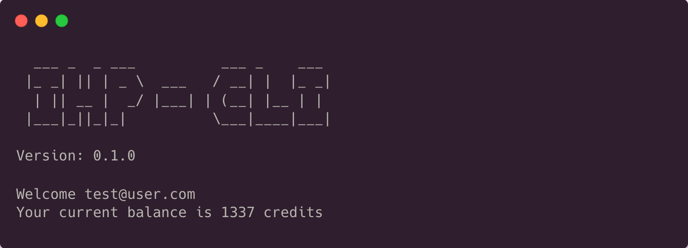

# IHP-CLI

The GoLang Cobra CLI for our hosting service.



## Features

#### Authentication Management

- Sign Up
- Sign In
- Logout

#### Instance Management

- Show instances
- Show detailed instance info
- Create custom or template instance
- Delete instance

#### Balance management

- Display balance
- Purchase balance

## Run Locally

Assuming you have Docker installed.

1. Clone the project

```bash
  git clone https://github.com/incompetent-hosting-provider/monorepo.git ihp
```

2. Go to the project directory

```bash
  cd ihp
```

3. Start the IHP-Stack (Keycloak, DB, Backend...)

```bash
docker compose up -d --force-recreate
```

4. Go to the cli directory

```bash
cd cli
```

5. Run the CLI

```bash
go run main.go <subcommands...>
```

##### _NOTE: The `go run main.go` command substitutes the `ihp` root command._

## Running Tests

To run tests, run the following command while in the CLI directory

```bash
go test ./...
```

## Deployment

The project will be build and deployed automatically when changes have been made to the `main`branch.
